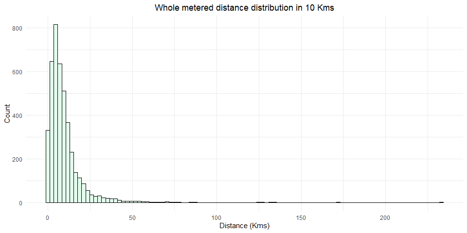

```r
library(tidyverse, quietly = T)
library(echarts4r)
library(magrittr)
library(kableExtra)
library(gridExtra)
library(tidymodels)
```

<style type="text/css">

h1, #TOC>ul>li {
  color: #B6854D;
  font-family:  "Times";
  font-weight: bold;
}

h2, #TOC>ul>ul>li {
  color: #F4B5BD;
  font-family:  "Times";
  font-weight: bold;
}

</style>


# Background

This is a project done on a data set of a mobility company that offers rides in Europe.

The key aspect of ride-hailing is predicted (upfront) pricing, which works the following way. First, it predicts the price for a ride based on predicted distance and time. This price is what you see on the screen of the phone before ordering a ride. Second, if the metered price based on actual distance and time differs a lot from the predicted one, the upfront price switches to the metered price. 'A lot' means by more than 20%. For example, suppose you want to make a ride that upfront price predicts to cost 5 euros. If the metered price is between 4 and 6 euros - the rider pays 5 euros, otherwise the metered price. 
The aim of the project is to improve the upfront pricing precision. The data is analyzed below to identify top opportunities for that highlighting the top opportunities to be prioritized.

# EDA - Exploratory Data Analysis

In this part I'll explore the data, investigate for patterns and aim to reach to a conclusion.


```r
## Reading Data
df_raw = read.csv('data.csv')
df = df_raw
```

## Dataset checkup

### Duplicates

Noticed that the `order_id` which represents the driver ticket is duplicated for `ticket_id_new` customer support ticket, meaning that a customer can open multiple tickets against an order.

Checking for duplicate rows returns 0 duplicates obviously as we have the `ticket_id` being unique.

So there are two ways I'd use to check for the duplicates:

1.  <u>**Customer ticket duplicates:**</u> Check for the duplicates against the new ticket `order_id_new`. This returned **777** duplicates.
2.  <u>**whole data frame excluding customer ticket:**</u> Exclude the `ticket_id` and check for duplicate rows. This returned **673** duplicates.

After a multiple trials, and to avoid confusion, I'll choose the 1st way after ordering the dataframe with `created time`, `order id` and `ticket id`, keeping the most recent tickets. I've removed **777** duplicates, having a dataframe of **4166** instead of **4943** observations.


```r
df = df %>% arrange(calc_created, order_id_new, ticket_id_new)

# Checking on duplicates by order id 777
dup_order = df[duplicated(df$order_id_new, fromLast = T),] 

# Checking on duplicate by excluding ticket id and counting 673
dup_exec_tickets = df[duplicated(df %>%  select(-ticket_id_new), fromLast = T),] 

# Anti-join
dup_differentials = anti_join(dup_order, dup_exec_tickets, by = c("order_id_new"="order_id_new", "ticket_id_new"="ticket_id_new"))

df = df[!(df$ticket_id_new %in% dup_order $ticket_id_new),] 
```

### Mismatches

I'm having **46** mismatches between `order_id_new` and `order_try_id_new` .. I'm not sure the reason and the documentation is putting the same definition for both columns, but it seems the order id numbers overlap for a reason.


```r
print(df %>% filter(order_id_new != order_try_id_new) %>% nrow(.))
```

```
[1] 46
```

### Missing values

The below are the missing values after removing the duplicates.


```r
(colMeans(is.na(df)) * 100) %>% 
  round(.,3) %>% 
  as.data.frame() %>% 
  rownames_to_column() %>% set_colnames(c("columns","missing_perc")) %>% 
  inner_join(
              colSums(is.na(df)) %>% 
              as.data.frame() %>% 
              rownames_to_column() %>% set_colnames(c("columns","count")),
              by = c("columns" = "columns")
              ) %>% 
  filter(missing_perc != 0) %>% 
  arrange(desc(missing_perc)) %>% 
  kbl(format = "html", caption = "Missing values") %>%    
  kable_minimal() %>% 
  kable_styling( full_width = F) %>%
  column_spec(1:1, bold = T, color = "black", background = "#e3fded")
```

<table class=" lightable-minimal table" style='font-family: "Trebuchet MS", verdana, sans-serif; margin-left: auto; margin-right: auto; width: auto !important; margin-left: auto; margin-right: auto;'>
<caption>Missing values</caption>
 <thead>
  <tr>
   <th style="text-align:left;"> columns </th>
   <th style="text-align:right;"> missing_perc </th>
   <th style="text-align:right;"> count </th>
  </tr>
 </thead>
<tbody>
  <tr>
   <td style="text-align:left;font-weight: bold;color: black !important;background-color: #e3fded !important;"> device_token </td>
   <td style="text-align:right;"> 100.000 </td>
   <td style="text-align:right;"> 4166 </td>
  </tr>
  <tr>
   <td style="text-align:left;font-weight: bold;color: black !important;background-color: #e3fded !important;"> fraud_score </td>
   <td style="text-align:right;"> 53.721 </td>
   <td style="text-align:right;"> 2238 </td>
  </tr>
  <tr>
   <td style="text-align:left;font-weight: bold;color: black !important;background-color: #e3fded !important;"> upfront_price </td>
   <td style="text-align:right;"> 29.285 </td>
   <td style="text-align:right;"> 1220 </td>
  </tr>
  <tr>
   <td style="text-align:left;font-weight: bold;color: black !important;background-color: #e3fded !important;"> metered_price </td>
   <td style="text-align:right;"> 0.456 </td>
   <td style="text-align:right;"> 19 </td>
  </tr>
  <tr>
   <td style="text-align:left;font-weight: bold;color: black !important;background-color: #e3fded !important;"> predicted_distance </td>
   <td style="text-align:right;"> 0.456 </td>
   <td style="text-align:right;"> 19 </td>
  </tr>
  <tr>
   <td style="text-align:left;font-weight: bold;color: black !important;background-color: #e3fded !important;"> predicted_duration </td>
   <td style="text-align:right;"> 0.456 </td>
   <td style="text-align:right;"> 19 </td>
  </tr>
</tbody>
</table>

## Univariate analysis

Briefly inspecting prices, durations and distances I can notice that data will be skewed, a higher variance in certain columns along with outliers.


```r
psych::describe(df %>% 
          select(duration, distance, predicted_duration, predicted_distance, upfront_price, metered_price)
        ) %>% 
  kbl() %>% 
  kable_paper()
```

<table class=" lightable-paper" style='font-family: "Arial Narrow", arial, helvetica, sans-serif; margin-left: auto; margin-right: auto;'>
 <thead>
  <tr>
   <th style="text-align:left;">   </th>
   <th style="text-align:right;"> vars </th>
   <th style="text-align:right;"> n </th>
   <th style="text-align:right;"> mean </th>
   <th style="text-align:right;"> sd </th>
   <th style="text-align:right;"> median </th>
   <th style="text-align:right;"> trimmed </th>
   <th style="text-align:right;"> mad </th>
   <th style="text-align:right;"> min </th>
   <th style="text-align:right;"> max </th>
   <th style="text-align:right;"> range </th>
   <th style="text-align:right;"> skew </th>
   <th style="text-align:right;"> kurtosis </th>
   <th style="text-align:right;"> se </th>
  </tr>
 </thead>
<tbody>
  <tr>
   <td style="text-align:left;"> duration </td>
   <td style="text-align:right;"> 1 </td>
   <td style="text-align:right;"> 4166 </td>
   <td style="text-align:right;"> 1488.744 </td>
   <td style="text-align:right;"> 1586.8351 </td>
   <td style="text-align:right;"> 1019.50 </td>
   <td style="text-align:right;"> 1200.3677 </td>
   <td style="text-align:right;"> 773.17590 </td>
   <td style="text-align:right;"> 0 </td>
   <td style="text-align:right;"> 22402.0 </td>
   <td style="text-align:right;"> 22402.0 </td>
   <td style="text-align:right;"> 3.848786 </td>
   <td style="text-align:right;"> 26.62599 </td>
   <td style="text-align:right;"> 24.58511 </td>
  </tr>
  <tr>
   <td style="text-align:left;"> distance </td>
   <td style="text-align:right;"> 2 </td>
   <td style="text-align:right;"> 4166 </td>
   <td style="text-align:right;"> 9482.639 </td>
   <td style="text-align:right;"> 10763.0546 </td>
   <td style="text-align:right;"> 6918.50 </td>
   <td style="text-align:right;"> 7720.7975 </td>
   <td style="text-align:right;"> 5584.95420 </td>
   <td style="text-align:right;"> 0 </td>
   <td style="text-align:right;"> 233190.0 </td>
   <td style="text-align:right;"> 233190.0 </td>
   <td style="text-align:right;"> 5.948785 </td>
   <td style="text-align:right;"> 76.25401 </td>
   <td style="text-align:right;"> 166.75386 </td>
  </tr>
  <tr>
   <td style="text-align:left;"> predicted_duration </td>
   <td style="text-align:right;"> 3 </td>
   <td style="text-align:right;"> 4147 </td>
   <td style="text-align:right;"> 1082.257 </td>
   <td style="text-align:right;"> 816.1494 </td>
   <td style="text-align:right;"> 916.00 </td>
   <td style="text-align:right;"> 981.6755 </td>
   <td style="text-align:right;"> 548.56200 </td>
   <td style="text-align:right;"> 0 </td>
   <td style="text-align:right;"> 20992.0 </td>
   <td style="text-align:right;"> 20992.0 </td>
   <td style="text-align:right;"> 7.586889 </td>
   <td style="text-align:right;"> 143.86503 </td>
   <td style="text-align:right;"> 12.67368 </td>
  </tr>
  <tr>
   <td style="text-align:left;"> predicted_distance </td>
   <td style="text-align:right;"> 4 </td>
   <td style="text-align:right;"> 4147 </td>
   <td style="text-align:right;"> 8758.413 </td>
   <td style="text-align:right;"> 11101.8562 </td>
   <td style="text-align:right;"> 6777.00 </td>
   <td style="text-align:right;"> 7290.5249 </td>
   <td style="text-align:right;"> 4536.75600 </td>
   <td style="text-align:right;"> 0 </td>
   <td style="text-align:right;"> 353538.0 </td>
   <td style="text-align:right;"> 353538.0 </td>
   <td style="text-align:right;"> 14.193906 </td>
   <td style="text-align:right;"> 338.41505 </td>
   <td style="text-align:right;"> 172.39655 </td>
  </tr>
  <tr>
   <td style="text-align:left;"> upfront_price </td>
   <td style="text-align:right;"> 5 </td>
   <td style="text-align:right;"> 2946 </td>
   <td style="text-align:right;"> 3730.914 </td>
   <td style="text-align:right;"> 17689.9578 </td>
   <td style="text-align:right;"> 6.40 </td>
   <td style="text-align:right;"> 1227.9482 </td>
   <td style="text-align:right;"> 4.44780 </td>
   <td style="text-align:right;"> 2 </td>
   <td style="text-align:right;"> 595000.0 </td>
   <td style="text-align:right;"> 594998.0 </td>
   <td style="text-align:right;"> 22.147102 </td>
   <td style="text-align:right;"> 629.97564 </td>
   <td style="text-align:right;"> 325.91956 </td>
  </tr>
  <tr>
   <td style="text-align:left;"> metered_price </td>
   <td style="text-align:right;"> 6 </td>
   <td style="text-align:right;"> 4147 </td>
   <td style="text-align:right;"> 7019.153 </td>
   <td style="text-align:right;"> 14501.7689 </td>
   <td style="text-align:right;"> 10.78 </td>
   <td style="text-align:right;"> 3786.5616 </td>
   <td style="text-align:right;"> 11.53463 </td>
   <td style="text-align:right;"> 2 </td>
   <td style="text-align:right;"> 194483.5 </td>
   <td style="text-align:right;"> 194481.5 </td>
   <td style="text-align:right;"> 4.507308 </td>
   <td style="text-align:right;"> 30.84461 </td>
   <td style="text-align:right;"> 225.19252 </td>
  </tr>
</tbody>
</table>

### EU orders split

The dataset observations are not solely from European countries, there seems to be countries outside Europe as well. The data's variance might not be impacted on duration and distance, but it will impact on price.

The below split is the distribution of EU observations vs. Non-EU.


```r
df %>% 
  group_by(eu_indicator) %>% 
  summarise(count = n()) %>% 
  mutate(eu_indicator = if_else(eu_indicator == 1,"EU","Non-EU")) %>% 
  e_charts(eu_indicator) %>% 
  e_pie(count, radius = c("40%", "60%"), 
        color = c("#e3fded","#f8afa8"),
        itemStyle = list(borderWidth = 1, borderColor = "rgba(0, 0, 0, 1)")) %>% 
  e_title("EU Countries vs Non-EU", left="center") %>% 
  e_legend(show = T, 
           name = ~ eu_indicator,
           icon = rep('circle',length(unique(.))),
           textStyle = list(fontSize = 14), 
           orient = "vertical", right = "10", top = "10",
           tooltip = list(show = T, position = "right")
           ) %>% 
  e_labels(show = TRUE,
           formatter = "{c} \n {d}%",
           position = "outside")
```

```{=html}
<div id="htmlwidget-4f42c3da59e0bd9f260e" style="width:100%;height:500px;" class="echarts4r html-widget"></div>
<script type="application/json" data-for="htmlwidget-4f42c3da59e0bd9f260e">{"x":{"theme":"","tl":false,"draw":true,"renderer":"canvas","events":[],"buttons":[],"opts":{"legend":{"data":[{"name":"Non-EU","icon":"circle"},{"name":"EU","icon":"circle"}],"show":true,"type":"plain","name":{},"textStyle":{"fontSize":14},"orient":"vertical","right":"10","top":"10","tooltip":{"show":true,"position":"right"}},"series":[{"name":"count","type":"pie","radius":["40%","60%"],"color":["#e3fded","#f8afa8"],"itemStyle":{"borderWidth":1,"borderColor":"rgba(0, 0, 0, 1)"},"data":[{"value":1682,"name":"Non-EU"},{"value":2484,"name":"EU"}],"label":{"show":true,"position":"outside","formatter":"{c} \n {d}%"}}],"title":[{"left":"center","text":"EU Countries vs Non-EU"}]},"dispose":true},"evals":[],"jsHooks":[]}</script>
```

### Distances

#### Distance metered distribution {.tabset}

The below two tables show the whole metered distance and the distance less than 60 km

##### Whole distance

The metered distance is right skewed along with a 2xx km.


```r
ggplot(data = df, aes(x = distance/1000)) +
  geom_histogram(bins=100, fill='#e3fded', color = 'black') +
  labs(title = "Whole metered distance distribution in 10 Kms",
       x = "Distance (Kms)", 
       y = "Count") +
  theme_minimal() +
  theme(plot.title = element_text(hjust = 0.5)) 
```

<!-- -->

##### Distance < 60Km

The metered distance up to 60km, you can see that most of the rides range from 2 km to 20km.


```r
df %>% 
  filter(distance <= 60000) %>% 
  ggplot(data = ., aes(x = distance/1000)) +
  geom_histogram(binwidth = 1, bins = 60, color = 'black', fill = '#e3fded') +
  scale_x_continuous(breaks = seq(0,60,2),
                     sec.axis = sec_axis(~ ., 
                                         breaks = seq(0,60,10),
                                         labels = scales::label_number(suffix = " km")
                                         )
                     ) +
  scale_y_continuous(breaks = seq(0,400,50)) +
  labs(title = "Whole metered distance distribution in (Kms)",
       x = "Distance (Kms)", 
       y = "Count") +
  theme_minimal() +
  theme(plot.title = element_text(hjust = 0.5), panel.grid.minor = element_blank())
```

<!-- -->

#### Distance predicted distribution {.tabset}

The below two tables show the whole predicted distance and the distance less than 60 km

##### Whole distance

Predicted distance looks more skewed compared to metered distance.


```r
ggplot(data = df, aes(x = predicted_distance/1000)) +
  geom_histogram(bins=100, fill='#e3fded', color = 'black') +
  labs(title = "Whole predicted distance distribution in 10 Kms",
       x = "Distance (Kms)", 
       y = "Count") +
  scale_x_continuous(breaks = seq(0,350,50)) +
  theme_minimal() +
  theme(plot.title = element_text(hjust = 0.5)) 
```

<!-- -->

##### Distance \< 60Km

The predicted distance distribution looks bit similar the metered, however, there are less 0 distances here.


```r
df %>% 
  filter(predicted_distance <= 60000) %>% 
  ggplot(data = ., aes(x = predicted_distance/1000)) +
  geom_histogram(binwidth = 1, bins = 60, color = 'black', fill = '#e3fded') +
  scale_x_continuous(breaks = seq(0,60,2),
                     sec.axis = sec_axis(~ ., 
                                         breaks = seq(0,60,10),
                                         labels = scales::label_number(suffix = " km")
                                         )
                     ) +
  scale_y_continuous(breaks = seq(0,400,50)) +
  labs(title = "Predicted distance distribution in (Kms)",
       x = "Distance (Kms)", 
       y = "Count") +
  theme_minimal() +
  theme(plot.title = element_text(hjust = 0.5), panel.grid.minor = element_blank())
```

<!-- -->

### Durations

#### Duration metered distribution {.tabset}

Most rides are less than two hours, plot is right skewed as well and most rides range from 10 - 20 mins.

##### Whole durations (hrs)


```r
ggplot(data = df, aes(x = duration/60/60)) +
  geom_histogram(bins=6*4, fill='#e3fded', color = 'black') +
  scale_x_continuous(breaks = seq(0,6,1)) +
  labs(title = "Whole metered duration in (hours)",
       x = "Duration (hours)", 
       y = "Count") +
  theme_minimal() +
  theme(plot.title = element_text(hjust = 0.5))
```

<!-- -->

##### Whole durations (mins)


```r
df %>% 
  mutate(duration_hr = duration/60/60) %>% 
  filter(duration_hr <= 4) %>% 
  ggplot(data = ., aes(x = duration/60)) +
  geom_histogram(binwidth = 1, bins = 240, color = 'black', fill = '#e3fded') +
  labs(title = "Whole metered duration in (mins)",
       x = "Duration (mins)", 
       y = "Count") +
  theme_minimal() +
  theme(plot.title = element_text(hjust = 0.5), panel.grid.minor = element_blank()) +
  scale_x_continuous(breaks = seq(0,250,10),
                    sec.axis = sec_axis(~ ./60, 
                                        breaks = seq(0,60,1),
                                        labels = scales::label_number(suffix = " hr", accuracy = 1)
                                        )
                    ) +
  scale_y_continuous(breaks = seq(0,400,50))
```

<!-- -->

#### Duration predicted distribution {.tabset}

The predicted duration looks less than the actual, sounds like this is an under prediction.

##### Whole durations (hrs)


```r
ggplot(data = df, aes(x = predicted_duration/60/60)) +
  geom_histogram(bins=6*4, fill='#e3fded', color = 'black') +
  scale_x_continuous(breaks = seq(0,6,1)) +
  labs(title = "Whole predicted duration in (hours)",
       x = "Duration (hours)", 
       y = "Count") +
  theme_minimal() +
  theme(plot.title = element_text(hjust = 0.5))
```

<!-- -->

##### Whole durations (mins)


```r
df %>% 
  mutate(duration_hr = predicted_duration/60/60) %>% 
  filter(duration_hr <= 4) %>% 
  ggplot(data = ., aes(x = predicted_duration/60)) +
  geom_histogram(binwidth = 1, bins = 240, color = 'black', fill = '#e3fded') +
  labs(title = "Whole predicted duration in (mins)",
       x = "Duration (mins)", 
       y = "Count") +
  theme_minimal() +
  theme(plot.title = element_text(hjust = 0.5), panel.grid.minor = element_blank()) +
  scale_x_continuous(breaks = seq(0,250,10),
                    sec.axis = sec_axis(~ ./60, 
                                        breaks = seq(0,60,1),
                                        labels = scales::label_number(suffix = " hr", accuracy = 1)
                                        )
                    ) +
  scale_y_continuous(breaks = seq(0,400,50))
```

<!-- -->

### Price metered

I've split by EU/Non-EU due to the currency differences.


```r
df %>% 
  mutate(distance = metered_price,
         eu_indicator = if_else(eu_indicator == 1,"EU","Non-EU")) %>% 
  ggplot(data = ., aes(x = metered_price)) +
  geom_freqpoly(color = 'black', fill = '#259e64') +
  facet_wrap(~ eu_indicator, nrow = 1, scales = "free_x") +
  labs(title = "Metered prices EU vs. Non-EU",
       x = "Price", 
       y = "Count") +
  theme_minimal() +
  theme(plot.title = element_text(hjust = 0.5), panel.grid.minor = element_blank()) 
```

<!-- -->

### Daily Upfront price vs. Metered price ECDF

This is an Empirical cumulative density function plot, what it tries to show are the percentile of the both the metered and upfront prices.

For example, in EU, we can see that 50% of the data early 300s euros for the upfront price and early 400s for the metered price.

**Note:** This plot is an aggregation of **daily** prices which is why it looks smoothed, plotting singular prices produces a noisy chart.


```r
df %>% 
  mutate(eu_indicator = if_else(eu_indicator == 1,"EU","Non-EU")) %>% 
  mutate(ride_date = as.Date(calc_created, "%Y-%m-%d"),
         ride_time = format(as.POSIXlt(calc_created), "%H:%M:%S")) %>%
  select(ride_date, ride_time, eu_indicator, metered_price, upfront_price) %>% 
  
  group_by(eu_indicator, ride_date) %>% 
  summarise(metered_daily = sum(metered_price, na.rm = T),
            upfront_daily = sum(upfront_price, na.rm = T)) %>% 

  ggplot(data = .,) +
  facet_wrap(~ eu_indicator, nrow=2, scales="free_x") +
  stat_ecdf(aes(metered_daily, color = 'metered')) +
  stat_ecdf(aes(upfront_daily, color = 'upfront')) +
  scale_color_manual(values = c("#259e64","#6675ff")) +
  guides(color = guide_legend(title="price type")) +
  scale_x_continuous(labels = scales::comma) +
  labs(title = "Daily Upfront price vs. Metered price ECDF",
       x = "Price", 
       y = "Perentile") +
  theme_minimal() +
  theme(plot.title = element_text(hjust = 0.5), panel.grid.minor = element_blank())
```

<!-- -->

### Rides demand {.tabset}

#### Days

Notice the dips, there is a seasonality during mid-week.


```r
df %>% 
  mutate(eu_indicator = if_else(eu_indicator == 1,"EU","Non-EU")) %>% 
  mutate(ride_date = as.Date(calc_created, "%Y-%m-%d"),
         ride_time = format(as.POSIXlt(calc_created), "%H:%M:%S"),
         ride_day = weekdays(as.Date(calc_created))) %>%
  select(calc_created, ride_date, ride_time, ride_day) %>%
  group_by(ride_date) %>%
  summarise(count = n(),
            percentage=round( (n()/nrow(.)) * 100, 2)) %>%

  ggplot(data = ., aes(x = as.POSIXct(ride_date), y = count)) +
  geom_path(color = "#259e64") +
  scale_x_datetime(name = "Full day date", labels = scales::time_format("%a %d-%m"), breaks = "1 day") +
  labs(title = "Ride days",
       x = "Full day date", 
       y = "count") +
  theme_minimal() +
  theme(plot.title = element_text(hjust = 0.5),
        axis.text.x = element_text(angle = 90)) 
```

<!-- -->

#### Weekdays

This plot confirms that the demand is less mid week, specifically **Tuesdays**.


```r
df %>% 
  mutate(ride_date = as.Date(calc_created, "%Y-%m-%d"),
         ride_time = format(as.POSIXlt(calc_created), "%H:%M:%S"),
         ride_day = weekdays(as.Date(calc_created))) %>%
  select(calc_created, ride_date, ride_time, ride_day) %>%
  group_by(ride_day) %>%
  summarise(count = n(),
            percentage=round( (n()/nrow(.)) * 100, 2)) %>%
  ungroup() %>% 
  mutate(ride_day = factor(ride_day,
                           levels = c("Sunday",
                                      "Monday",
                                      "Tuesday",
                                      "Wednesday",
                                      "Thursday",
                                      "Friday",
                                      "Saturday")
                           )
         ) %>% 
  ggplot(data = ., aes(x = ride_day, y = count, group = 1)) +
  geom_line(color = "#259e64") +
  geom_point() +
  scale_y_continuous(breaks = seq(500,800,50)) +
  labs(title = "Ride by weekdays",
       x = "Weekday", 
       y = "Count") +
  theme_minimal() +
  theme(plot.title = element_text(hjust = 0.5))
```

<!-- -->

#### Peak hours

Notice across two markets, EU/Non-EU there is different seasonality.

In EU, there is a up-and-down fluctuation, however, in EU there is an increase up until 8 pm o'clock.


```r
df =
  df %>% 
  mutate(ride_hour = format(as.POSIXlt(calc_created), "%H"),
         day_part = case_when(as.numeric(ride_hour) >= 05 & as.numeric(ride_hour) <= 08 ~ "Early morning",
                              as.numeric(ride_hour) >= 09 & ride_hour <= 10 ~ "Morning",
                              ride_hour == 11 ~ "Late morning",
                                       
                              ride_hour >= 12 & ride_hour <= 15 ~ "Early afternoon",
                              ride_hour == 16 ~ "Late afternoon",
                                       
                              ride_hour >= 17 & ride_hour <= 18 ~ "Early evening",
                              ride_hour >= 19 & ride_hour <= 20 ~ "Late evening",
                                       
                              ride_hour >= 21 & ride_hour <= 23 ~ "Night",
                              ride_hour %in% c("00","01","02","03","04") ~ "Night")) %>% 
  mutate(day_part = factor(day_part, 
                           levels = c("Early morning",
                                      "Morning",
                                      "Late morning",
                                      "Early afternoon",
                                      "Late afternoon",
                                      "Early evening",
                                      "Late evening",
                                      "Night")
                           )
         )  

df %>% 
  select(ride_hour, day_part, eu_indicator) %>% 
    mutate(eu_indicator = if_else(eu_indicator == 1,"EU","Non-EU")) %>% 

  group_by(day_part) %>% 
  mutate(day_part_min = min(ride_hour),
         day_part_max = max(ride_hour)) %>% 
  ungroup() %>% 
  
  add_count(eu_indicator, ride_hour, day_part, name = "count") %>% 
  select(eu_indicator, ride_hour, day_part, day_part_min, day_part_max, count) %>% distinct_all() %>% 
  arrange(day_part) %>% 
  
  ggplot(data = ., aes(x = ride_hour, y = count)) +
  facet_wrap(~ eu_indicator, nrow=2) +
  geom_line(group = 1) +
  geom_point() +
  # geom_rect(aes(fill = day_part, xmin=day_part_min, xmax=day_part_max),
  #           ymin=-Inf, ymax = Inf,
  #           alpha = 0.1
  # ) +
  # scale_fill_manual(values=c("red","blue","orange","black","white","grey","cyan","brown"))

  scale_y_continuous(breaks = seq(0,300,25)) +
  labs(title = "Ride by hours",
       x = "Weekday", 
       y = "Count") +
  theme_minimal() +
  theme(plot.title = element_text(hjust = 0.5), panel.grid.minor = element_blank())
```

<!-- -->

### Univarite miscellaneous {.tabset}

#### GPS confidence

Only 18% of the data has GPS that is not confident.


```r
df %>% 
  group_by(gps_confidence) %>% 
  summarise(count = n()) %>% 
  mutate(gps_confidence = if_else(gps_confidence == 1,"Confident","Non-Confident")) %>% 
  e_charts(gps_confidence) %>% 
  e_pie(count, radius = c("40%", "60%"), 
        color = c("#f8afa8","#e3fded"),
        itemStyle = list(borderWidth = 1, borderColor = "rgba(0, 0, 0, 1)")) %>% 
  e_title("GPS confidence", left="center") %>% 
  e_legend(show = T, 
           name = ~ gps_confidence,
           icon = rep('circle',length(unique(.))),
           textStyle = list(fontSize = 14), 
           orient = "vertical", right = "10", top = "10",
           tooltip = list(show = T, position = "right")
           ) %>% 
  e_labels(show = TRUE,
           formatter = "{c} \n {d}%",
           position = "outside")
```

```{=html}
<div id="htmlwidget-a539e3278948be2f7872" style="width:100%;height:500px;" class="echarts4r html-widget"></div>
<script type="application/json" data-for="htmlwidget-a539e3278948be2f7872">{"x":{"theme":"","tl":false,"draw":true,"renderer":"canvas","events":[],"buttons":[],"opts":{"legend":{"data":[{"name":"Non-Confident","icon":"circle"},{"name":"Confident","icon":"circle"}],"show":true,"type":"plain","name":{},"textStyle":{"fontSize":14},"orient":"vertical","right":"10","top":"10","tooltip":{"show":true,"position":"right"}},"series":[{"name":"count","type":"pie","radius":["40%","60%"],"color":["#f8afa8","#e3fded"],"itemStyle":{"borderWidth":1,"borderColor":"rgba(0, 0, 0, 1)"},"data":[{"value":762,"name":"Non-Confident"},{"value":3404,"name":"Confident"}],"label":{"show":true,"position":"outside","formatter":"{c} \n {d}%"}}],"title":[{"left":"center","text":"GPS confidence"}]},"dispose":true},"evals":[],"jsHooks":[]}</script>
```

#### Ticket creator

95% of tickets are opened by clients.

Only 189 were opened by drivers.


```r
df %>% 
  group_by(entered_by) %>% 
  summarise(count = n()) %>% 
  e_charts(entered_by) %>% 
  e_pie(count, radius = c("40%", "60%"), 
        color = c("#e3fded","#f8afa8","#6675ff"),
        itemStyle = list(borderWidth = 1, borderColor = "rgba(0, 0, 0, 1)")) %>% 
  e_title("Ticket creator", left="center") %>% 
  e_legend(show = T, 
           name = ~ entered_by,
           icon = rep('circle',length(unique(.))),
           textStyle = list(fontSize = 14), 
           orient = "vertical", right = "10", top = "10",
           tooltip = list(show = T, position = "right")
           ) %>% 
  e_labels(show = TRUE,
           formatter = "{c} \n {d}%",
           position = "outside")
```

```{=html}
<div id="htmlwidget-89ffdde83c502c9a1504" style="width:100%;height:500px;" class="echarts4r html-widget"></div>
<script type="application/json" data-for="htmlwidget-89ffdde83c502c9a1504">{"x":{"theme":"","tl":false,"draw":true,"renderer":"canvas","events":[],"buttons":[],"opts":{"legend":{"data":[{"name":"client","icon":"circle"},{"name":"driver","icon":"circle"},{"name":"reseller","icon":"circle"}],"show":true,"type":"plain","name":{},"textStyle":{"fontSize":14},"orient":"vertical","right":"10","top":"10","tooltip":{"show":true,"position":"right"}},"series":[{"name":"count","type":"pie","radius":["40%","60%"],"color":["#e3fded","#f8afa8","#6675ff"],"itemStyle":{"borderWidth":1,"borderColor":"rgba(0, 0, 0, 1)"},"data":[{"value":3972,"name":"client"},{"value":189,"name":"driver"},{"value":5,"name":"reseller"}],"label":{"show":true,"position":"outside","formatter":"{c} \n {d}%"}}],"title":[{"left":"center","text":"Ticket creator"}]},"dispose":true},"evals":[],"jsHooks":[]}</script>
```

#### rider version


```r
df %>% 
  mutate(rider_app_version = str_sub(rider_app_version,1,6)) %>% 
  mutate(rider_app_version = fct_lump(rider_app_version,10)) %>% 
  group_by(rider_app_version) %>% 
  summarise(count = n()) %>% arrange(desc(count)) %>% 
  ggplot(data = ., aes(x=fct_reorder(rider_app_version, count, .desc = F), y = count)) +
  geom_col(color = 'black', fill='#e3fded') +
  coord_flip() +
  geom_text(aes(label=count), nudge_y = 50, size = 3) +
  labs(title = "Rider versions",
       x = "Version (Major)", 
       y = "Count") +
  theme_minimal() +
  theme(plot.title = element_text(hjust = 0.5)) 
```

<!-- -->

#### driver versions


```r
df %>% 
  mutate(driver_app_version = str_sub(driver_app_version,1,6)) %>% 
  #mutate(driver_app_version = fct_lump(driver_app_version,10)) %>% 
  group_by(driver_app_version) %>% 
  summarise(count = n()) %>% arrange(desc(count)) %>% 
  ggplot(data = ., aes(x=fct_reorder(driver_app_version, count, .desc = F), y = count)) +
  geom_col(color = 'black', fill='#e3fded') +
  coord_flip() +
  geom_text(aes(label=count), nudge_y = 75, size = 3) +
  labs(title = "Driver versions",
       x = "Version (Major)", 
       y = "Count") +
  theme_minimal() +
  theme(plot.title = element_text(hjust = 0.5)) 
```

<!-- -->

#### Cell phone phone_brand distribution


```r
df %>% 
  select(device_name) %>%
  distinct_all() %>% 
  rowwise() %>% 
  mutate(phone_brand =  str_split(device_name, " ",simplify = T)[1]) %>% 
  distinct_all() %>% 
  ungroup() %>% 
  select(phone_brand,device_name) %>% 
  mutate(phone_brand = str_to_lower(phone_brand),
         phone_brand = case_when(str_detect(phone_brand,"^iphone") ~ "iphone",
                           str_detect(phone_brand,"^tecno") ~ "tecno",
                           str_detect(phone_brand,"^infinix") ~ "infinix",
                           str_detect(phone_brand,"^htc") ~ "htc",
                           TRUE ~ phone_brand)) %>% 
  mutate(phone_brand = fct_lump(phone_brand,14)) %>% 
  group_by(phone_brand) %>% 
  summarise(count = n()) %>% 
  
  ggplot(data = ., aes(x=fct_reorder(phone_brand, count, .desc = F), y = count)) +
  geom_col(color = 'black', fill='#e3fded') +
  coord_flip() +
  geom_text(aes(label=count), nudge_y = 2, size = 3) +
  labs(title = "Cell-phone phone_brand distribution",
       x = "phone_brand", 
       y = "Count") +
  theme_minimal() +
  theme(plot.title = element_text(hjust = 0.5)) 
```

<!-- -->

## Feature Engineering

**Prices**:

-   `price_comparison`: Whether the upfront prices is pricier or cheaper.
-   `price_difference`: Price difference `upfront price` - `metered prcice`.
-   `price_diff_pct`: Difference in percentages.
-   `price_used`: If the metered price is 20% more or less than upfront price., use the metered price.

**Distances:**

-   `distance_diff`: Difference between `predicted distance` - `metered distance`
-   `distance_diff_pct`: Distance percentage differences
-   `distance_tier`: Distance tiers in 5k, i.e. 0-5km, 5-10km, 10-15km etc.

**Durations:**

-   `duration_diff`: Difference between `predicted duration` - `metered duration`
-   `duration_diff_pct`: Duration percentage differences

**Dates:**

-   `ride date`: Date of the ride excluding time.

-   `ride day`: Day of week / name of the day .. i.e. Sunday, Monday, etc.

-   `ride time`: Time of the ride excluding date.

-   `ride hour`: Hour of the ride.

-   `day part`: Part of the day name as if Early morning, Morning, Afternoon, etc.

-   `phone_brand`: Brand of the phone phone device excluding the model.


```r
df = 
  df %>% 
  mutate(distance_diff = predicted_distance - distance,
         duration_diff = predicted_duration - duration,
         
         distance_diff_pct = round((predicted_distance - distance)/predicted_distance*100,2),
         duration_diff_pct = round((predicted_duration - duration)/predicted_duration*100,2),
         
         price_comparison = if_else(upfront_price > metered_price, "Pricier", "Cheaper"),
         price_difference = upfront_price - metered_price,
         price_diff_pct = round((upfront_price - metered_price)/upfront_price*100,2),
         price_used = case_when(price_diff_pct >= -20 & price_diff_pct <= 20 ~ "upfront",
                               price_diff_pct < -20 | price_diff_pct > 20 ~ "metered",
                               TRUE ~ "Null"),
         
         distance_tier = case_when(distance > 0 & distance < 5000 ~ "0-5km",
                                   distance > 5000 & distance < 10000 ~ "0-10km",
                                   distance > 10000 & distance < 15000 ~ "10-15km",
                                   distance > 15000 & distance < 20000 ~ "15-20km",
                                   distance > 20000 & distance < 25000 ~ "20-25km",
                                   distance > 25000 & distance < 30000 ~ "25-30km",
                                   distance > 30000 & distance < 35000 ~ "30km-35km",
                                   distance > 35000 & distance < 40000 ~ "35km-40km",
                                   distance > 40000 & distance < 45000 ~ "40km-45km",
                                   distance > 45000 & distance < 55000 ~ "50km-55km",
                                   distance > 55000 & distance < 60000 ~ "55km-60km",
                                   distance > 60000 & distance < 65000 ~ "60km-65km",
                                   TRUE ~ ">65km"),
         distance_tier = factor(distance_tier, levels = c("0-5km",
                                                          "0-10km",
                                                          "10-15km",
                                                          "15-20km",
                                                          "20-25km",
                                                          "25-30km",
                                                          "30km-35km",
                                                          "35km-40km",
                                                          "40km-45km",
                                                          "50km-55km",
                                                          "55km-60km",
                                                          "60km-65km"),
                                
                                ),
         ride_date = as.Date(calc_created, "%Y-%m-%d"),
         ride_time = format(as.POSIXlt(calc_created), "%H:%M:%S"),
         ride_day = weekdays(as.Date(calc_created)),
         ride_day = factor(ride_day, levels = c("Sunday","Monday","Tuesday","Wednesday","Thursday","Friday","Saturday"))) %>% 
         
  rowwise() %>% 
  
  mutate(phone_brand =  str_split(device_name, " ",simplify = T)[1],
         phone_brand = str_to_lower(phone_brand),
         phone_brand = case_when(str_detect(phone_brand,"^iphone") ~ "iphone",
                                 str_detect(phone_brand,"^tecno") ~ "tecno",
                                 str_detect(phone_brand,"^infinix") ~ "infinix",
                                 str_detect(phone_brand,"^htc") ~ "htc",
                                 TRUE ~ phone_brand)
         ) %>% 
  ungroup()
```

## Bivariate Analysis

Co relation looks linear between actual distance and actual price. There are 0 distances with prices, sounds like there is a constant **base fare**.

### Prices corelation with distance {.tabset}

The below is a scatter plot that shows the correlation between prices (metered in green & upfront in purple) and distance.

The line is a linear regression fitted line based on the metered price.

#### Europe


```r
df %>% 
  filter(eu_indicator == 1) %>% 
  {
    ggplot(data = ., aes(x = distance/1000)) +
      geom_jitter(aes(y=upfront_price, color = "upfront"), alpha = 1/5) +
      geom_jitter(aes(y=metered_price, color = "metered"), alpha = 1/15) +
      geom_smooth(aes(y=metered_price), method = 'lm', color = 'red', size=0.1, alpha=0.5) +  
      scale_color_manual(values = c("#259e64","#6675ff")) +
      guides(color = guide_legend(title="price type")) +
      scale_x_continuous(limits = c(0, quantile(.$distance/1000, 0.99))) +
      scale_y_continuous(limits = c(0, 40)) +
      labs(title = "Europe distance with prices co-relation",
             x = "Distance", 
             y = "Price") +
      theme_minimal() +
      theme(plot.title = element_text(hjust = 0.5)) 
  }
```

<!-- -->

#### Non-European

The metered price here looks as if it is only expensive on short distances.


```r
df %>% 
  filter(eu_indicator == 0) %>% 
  {
    ggplot(data = ., aes(x = distance/1000)) +
      geom_jitter(aes(y=upfront_price, color = "upfront"), alpha = 1/5) +
      geom_jitter(aes(y=metered_price, color = "metered"), alpha = 1/15) +
        geom_smooth(aes(y=metered_price), method = 'lm', color = 'red', size=0.1, alpha=0.5) +  
      scale_color_manual(values = c("#259e64","#6675ff")) +
      guides(color = guide_legend(title="price type")) +
      scale_x_continuous(limits = c(0, quantile(.$distance/1000, 0.99))) +
      scale_y_continuous(limits = c(0, 40000)) +
      labs(title = "Non-European distance with prices co-relation",
             x = "Distance", 
             y = "Price") +
      theme_minimal() +
      theme(plot.title = element_text(hjust = 0.5)) 
  }
```

```
## `geom_smooth()` using formula 'y ~ x'
```

<!-- -->

### Prices corelation with duration {.tabset}

The below is a scatter plot that shows the correlation between prices (metered in green & upfront in purple) and duration.

The line is a linear regression fitted line based on the metered price.

#### European


```r
df %>% 
  filter(eu_indicator == 1) %>% 
  {
    ggplot(data = ., aes(x = duration/60)) +
      geom_jitter(aes(y=upfront_price, color = "upfront"), alpha = 1/5) +
      geom_jitter(aes(y=metered_price, color = "metered"), alpha = 1/15) +
      geom_smooth(aes(y=metered_price), method = 'lm', color = 'red', size=0.1, alpha=0.5) +  
      scale_color_manual(values = c("#259e64","#6675ff")) +
      guides(color = guide_legend(title="price type")) +
      scale_x_continuous(limits = c(0, quantile(.$duration/60, 0.98))) +
      scale_y_continuous(limits = c(0, 40)) +
      labs(title = "Europe duration with prices co-relation",
             x = "Duration (mins)", 
             y = "Price") +
      theme_minimal() +
      theme(plot.title = element_text(hjust = 0.5)) 
  }
```

```
## `geom_smooth()` using formula 'y ~ x'
```

<!-- -->

#### Non-European


```r
df %>% 
  filter(eu_indicator == 0) %>% 
  {
    ggplot(data = ., aes(x = duration/60)) +
      geom_jitter(aes(y=upfront_price, color = "upfront"), alpha = 1/5) +
      geom_jitter(aes(y=metered_price, color = "metered"), alpha = 1/15) +
      geom_smooth(aes(y=metered_price), method = 'lm', color = 'red', size=0.1, alpha=0.5) +  
      scale_color_manual(values = c("#259e64","#6675ff")) +
      guides(color = guide_legend(title="price type")) +
      scale_x_continuous(limits = c(0, quantile(.$duration/60, 0.99))) +
      scale_y_continuous(limits = c(0, 40000)) +
      labs(title = "Non-European duration with prices co-relation",
             x = "Distance", 
             y = "Price") +
      theme_minimal() +
      theme(plot.title = element_text(hjust = 0.5)) 
  }
```

<!-- -->

### Durations differences

The below is a binned area plots that compare the distribution of duration in minutes.

The European market have a close distribution.

While the Non-European, You can notice that the metered duration is a long tailed which makes sense while the predicted isn't.


```r
df %>% 
  select(contains("duration"), eu_indicator) %>%
  filter(across(.cols = everything(),
                c(
                  ~. > -10000, ~. < 10000)
                )
         ) %>% 
  mutate(duration=duration/60, 
         predicted_duration=predicted_duration/60,
         duration_diff=duration_diff/60) %>% 
  mutate(eu_indicator = if_else(eu_indicator == 1,"EU","Non-EU")) %>% 
  
  ggplot(data = .) +
  geom_area(aes(x=duration, fill = "actual"), stat="bin", alpha = 0.4) +
  geom_area(aes(x=predicted_duration, fill = "predicted"), stat="bin", alpha = 0.2) +
  geom_area(aes(x=duration_diff, fill = "difference"), stat="bin", alpha = 0.6) +
  scale_x_continuous(breaks = seq(-150,150,25)) +
  scale_fill_manual(values = c("#259e64","#E2DCCD","#6675ff")) +
  guides(fill = guide_legend(title="Duration")) +
  labs(title = "Duration differences",
             x = "Duration (mins)", 
             y = "Count") +
  theme_minimal() +
  theme(plot.title = element_text(hjust = 0.5)) +
  facet_wrap(~ eu_indicator, ncol = 1)
```

<!-- -->

### Distance differences

When it comes to distances, we have the Non-Eu distribution having predictions under 30 KMs.


```r
df %>% 
  select(contains("distance"), eu_indicator, -distance_tier) %>% 
  filter(across(.cols = everything(),
                c(
                  ~. > -60000, ~. < 60000)
                )
         ) %>%
  mutate(distance=distance/1000, 
         predicted_distance=predicted_distance/1000,
         distance_diff=distance_diff/1000) %>% 
  mutate(eu_indicator = if_else(eu_indicator == 1,"EU","Non-EU")) %>% 
  
  ggplot(data = .) +
  geom_area(aes(x=distance, fill = "actual"), stat="bin", alpha = 0.4) +
  geom_area(aes(x=predicted_distance, fill = "predicted"), stat="bin", alpha = 0.2) +
  geom_area(aes(x=distance_diff, fill = "difference"), stat="bin", alpha = 0.6) +
  scale_x_continuous(breaks = seq(-60,60,10)) +
  guides(fill = guide_legend(title="Distances")) +
  scale_fill_manual(values = c("#259e64","#E2DCCD","#6675ff")) +
  labs(title = "Distance differences",
             x = "Distance (km)", 
             y = "Count") +
  theme_minimal() +
  theme(plot.title = element_text(hjust = 0.5)) +
  facet_wrap(~ eu_indicator, ncol=1)
```

<!-- -->

## Price profatibility

### Upfront vs. Actual price cost

This pie shows whether the Upfront price is cheaper or pricier to the metered price.

**29%** of the upfront predicted price is more expensive than the metered price. **44%** of the upfront predicted price is cheaper than the metered price.

This means our predicted price is not doing good.

We can call this a **Type I - Error** which is the worst .. having predicted a cheap price when in fact it should be more expensive, meaning we're having a loss.


```r
df %>% 
  group_by(price_comparison) %>% 
  summarise(count = n()) %>% 
  replace_na(list(price_comparison="NULL")) %>% 
  e_charts(price_comparison) %>% 
  e_pie(count, roseType = "radius", 
        color = c("#f8afa8","#e3fded","#FDF5E6"),
        itemStyle = list(borderWidth = 1, borderColor = "rgba(0, 0, 0, 1)")) %>% 
  e_title("Upfront vs. Actual price", left="center") %>% 
  e_legend(show = T, 
           name = ~ price_comparison,
           icon = rep('circle',length(unique(.))),
           textStyle = list(fontSize = 14), 
           orient = "vertical", right = "10", top = "10",
           tooltip = list(show = T, position = "right")
           ) %>% 
  e_labels(show = TRUE,
           formatter = "{c} \n {d}%",
           position = "outside")
```

```{=html}
<div id="htmlwidget-c810748a07eda16ddc39" style="width:100%;height:500px;" class="echarts4r html-widget"></div>
<script type="application/json" data-for="htmlwidget-c810748a07eda16ddc39">{"x":{"theme":"","tl":false,"draw":true,"renderer":"canvas","events":[],"buttons":[],"opts":{"legend":{"data":[{"name":"Cheaper","icon":"circle"},{"name":"Pricier","icon":"circle"},{"name":"NULL","icon":"circle"}],"show":true,"type":"plain","name":{},"textStyle":{"fontSize":14},"orient":"vertical","right":"10","top":"10","tooltip":{"show":true,"position":"right"}},"series":[{"name":"count","type":"pie","roseType":"radius","color":["#f8afa8","#e3fded","#FDF5E6"],"itemStyle":{"borderWidth":1,"borderColor":"rgba(0, 0, 0, 1)"},"data":[{"value":1860,"name":"Cheaper"},{"value":1086,"name":"Pricier"},{"value":1220,"name":"NULL"}],"label":{"show":true,"position":"outside","formatter":"{c} \n {d}%"}}],"title":[{"left":"center","text":"Upfront vs. Actual price"}]},"dispose":true},"evals":[],"jsHooks":[]}</script>
```

### Price used

As per the documentation, the App only switches if there is a 20% more or less than the metered price.

The below shows the count and percentages of whether the metered or the upfront was used.


```r
df %>% 
  group_by(price_used) %>% 
  summarise(count = n()) %>% 
  e_charts(price_used) %>% 
  e_pie(count, roseType = "radius", 
        color = c("#f8afa8","#FDF5E6","#e3fded"),
        itemStyle = list(borderWidth = 1, borderColor = "rgba(0, 0, 0, 1)")) %>% 
  e_title("Upfront vs. Actual price used", left="center") %>% 
  e_legend(show = T, 
           name = ~ price_used,
           icon = rep('circle',length(unique(.))),
           textStyle = list(fontSize = 14), 
           orient = "vertical", right = "10", top = "10",
           tooltip = list(show = T, position = "right")
           ) %>% 
  e_labels(show = TRUE,
           formatter = "{c} \n {d}%",
           position = "outside")
```

```{=html}
<div id="htmlwidget-cc20c9583c641fc332f1" style="width:100%;height:500px;" class="echarts4r html-widget"></div>
<script type="application/json" data-for="htmlwidget-cc20c9583c641fc332f1">{"x":{"theme":"","tl":false,"draw":true,"renderer":"canvas","events":[],"buttons":[],"opts":{"legend":{"data":[{"name":"metered","icon":"circle"},{"name":"Null","icon":"circle"},{"name":"upfront","icon":"circle"}],"show":true,"type":"plain","name":{},"textStyle":{"fontSize":14},"orient":"vertical","right":"10","top":"10","tooltip":{"show":true,"position":"right"}},"series":[{"name":"count","type":"pie","roseType":"radius","color":["#f8afa8","#FDF5E6","#e3fded"],"itemStyle":{"borderWidth":1,"borderColor":"rgba(0, 0, 0, 1)"},"data":[{"value":1339,"name":"metered"},{"value":1220,"name":"Null"},{"value":1607,"name":"upfront"}],"label":{"show":true,"position":"outside","formatter":"{c} \n {d}%"}}],"title":[{"left":"center","text":"Upfront vs. Actual price used"}]},"dispose":true},"evals":[],"jsHooks":[]}</script>
```

### Upfront metered price percentage differences {.tabset}

You can see in the below two tabs that the upfront price under performs by predicting cheaper prices due to the lower predicitions of duration/distances.

In the Non European market, the cheaper tail is longer, meaning there are more negative/cheaper differences.

#### European


```r
df %>% 
  filter(eu_indicator == 1, metered_price < 50) %>% 
  select(contains('price')) %>% 
  ggplot(data = .) +
  geom_histogram(aes(x = price_diff_pct, fill=price_comparison), binwidth = 10, color = "black") +
  scale_x_continuous(breaks = seq(-200,200, 50), limits = c(-200,200)) +
  scale_y_continuous(breaks = seq(0,700,100)) +
  scale_fill_manual(values = c("#f8afa8","#e3fded")) +
  labs(title = "Prices percentage differences",
       x = "Percentage difference", 
       y = "Count") +
  theme_minimal() +
  theme(plot.title = element_text(hjust = 0.5)) 
```

<!-- -->

#### Non-European


```r
df %>% 
  filter(eu_indicator == 0) %>% 
  select(contains('price')) %>% 
  ggplot(data = .) +
  geom_histogram(aes(x = price_diff_pct, fill=price_comparison), binwidth = 10, color = 'black') +
  scale_x_continuous(breaks = seq(-200,200, 50), limits = c(-200,200)) +
  scale_y_continuous(breaks = seq(0,200,10)) +
  scale_fill_manual(values = c("#f8afa8","#e3fded")) +
  labs(title = "Prices percentage differences",
       x = "Percentage difference", 
       y = "Count") +
  theme_minimal() +
  theme(plot.title = element_text(hjust = 0.5)) 
```

<!-- -->

### Prediction difference {.tabset}

Digging deeper, since the predicted prices is dependent on predicted duration and predicted distance, let's see:

1- The duration percentage differences

2- The distance percentage differences

for both EU/Non-EU.

Looking at both variables (Distance & Duration) We can see that the duration is much worse when it comes to prediction having more differences, especially for the Non-European market.

The distance in the 2nd tab has more negatives than positives as well, but the Non-EU is a bit close to the EU.

#### Duration


```r
duration.eu.plt <-
  df %>% 
  filter(eu_indicator == 1) %>% 
  select(contains("duration"), eu_indicator) %>% 
  mutate(duration_diff_type = if_else(duration_diff_pct > 0, "positive", "negative")) %>% 
  drop_na() %>% 
  ggplot(data = ., aes(x = duration_diff_pct, fill = duration_diff_type)) +
  geom_histogram(alpha=1/8, 
                 color='black',
                 position='identity',
                 binwidth = 10) +
  scale_x_continuous(breaks = seq(-500,500,50), limits = c(-500,500)) +
  scale_y_continuous(breaks = seq(0,600,100)) +
  scale_y_reverse() +
  coord_flip() +
  labs(title = "EU",
       x = "Percentage difference", 
       y = "Count") +
  theme_minimal() +
  theme(plot.title = element_text(hjust = 0.5), legend.position = "none") 

duration.noneu.plt <-
  df %>% 
  filter(eu_indicator == 0) %>% 
  select(contains("duration"), eu_indicator) %>% 
  mutate(duration_diff_type = if_else(duration_diff_pct > 0, "positive", "negative")) %>% 
  drop_na() %>% 
  ggplot(data = ., aes(x = duration_diff_pct, fill = duration_diff_type)) +
  geom_histogram(alpha=1/8, 
                 color='black',
                 position='identity',
                 binwidth = 10) +
  scale_x_continuous(breaks = seq(-500,500,50), limits = c(-500,500)) +
  scale_y_continuous(breaks = seq(0,600,100)) +
  coord_flip() +
  labs(title = "Non-EU",
       x="",
       y = "Count") +
  theme_minimal() +
  theme(plot.title = element_text(hjust = 0.5), 
        axis.ticks.y = element_blank(),
        axis.text.y = element_blank(), legend.position = "none") 

layout <- rbind(c(1,1,2,2),
                c(1,1,2,2))

g1 <- ggplotGrob(duration.eu.plt)
g2 <- ggplotGrob(duration.noneu.plt)
gridExtra::grid.arrange(g1, g2,nrow = 1, layout_matrix = layout)
```

<!-- -->

#### Distance


```r
distance.eu.plt <-
  df %>% 
  filter(eu_indicator == 1) %>% 
  select(contains("distance")) %>% 
  mutate(distance_diff_type = if_else(distance_diff_pct > 0, "positive", "negative")) %>% 
  drop_na() %>% 
  
  ggplot(data = ., aes(x = distance_diff_pct, fill = distance_diff_type)) +
  geom_histogram(alpha=1/8, 
                 color='black',
                 position='identity',
                 binwidth = 10) +
  scale_x_continuous(breaks = seq(-500,500,50), limits = c(-500,500)) +
  scale_y_continuous(breaks = seq(0,600,100)) +
  scale_y_reverse() +
  coord_flip() +
  labs(title = "EU",
       x = "Percentage difference", 
       y = "Count") +
  theme_minimal() +
  theme(plot.title = element_text(hjust = 0.5), legend.position = "none") 

distance.noneu.plt <-
  df %>% 
  filter(eu_indicator == 0) %>% 
  select(contains("distance")) %>% 
  mutate(distance_diff_type = if_else(distance_diff_pct > 0, "positive", "negative")) %>% 
  drop_na() %>% 
  ggplot(data = ., aes(x = distance_diff_pct, fill = distance_diff_type)) +
  geom_histogram(alpha=1/8, 
                 color='black',
                 position='identity',
                 binwidth = 10) +
  scale_x_continuous(breaks = seq(-500,500,50), limits = c(-500,500)) +
  scale_y_continuous(breaks = seq(0,600,100)) +
  coord_flip() +
  labs(title = "Non-EU",
       x = "", 
       y = "Count") +
  theme_minimal() +
  theme(plot.title = element_text(hjust = 0.5), 
        axis.ticks.y = element_blank(),
        axis.text.y = element_blank(), legend.position = "none") 

layout <- rbind(c(1,1,2,2),
                c(1,1,2,2))

g3 <- ggplotGrob(distance.eu.plt)
g4 <- ggplotGrob(distance.noneu.plt)
gridExtra::grid.arrange(g3, g4, nrow = 1, layout_matrix = layout)
```

<!-- -->

## Analytical Questions

The question is when can we say the Upfront price is not performing well?

I'd say when:

1.  We **switch** from upfront to metered.
2.  When it is more expensive and/or more importantly **cheaper**.

#### Q1 - Is there a specific distance tier where we have price switches or is cheaper? {.tabset}

We can that the price tends to be cheaper when it comes to higher distances.

In the 2nd tab, When it comes to which price is used, there is no specific pattern.

##### Switch metric


```r
df %>% 
  select(distance_tier, price_comparison) %>% 
  group_by(distance_tier, price_comparison) %>% 
  summarise(count = n(),
            percentage=round( (n()/nrow(.)) * 100, 1), 
            .groups = 'drop'
            ) %>% 
  arrange(distance_tier, price_comparison) %>% 
  ungroup() %>% 
  mutate(row_num=row_number()) %>% 
  distinct_all() %>% drop_na() %>% 
  
    
  ggplot(data = ., aes(x = distance_tier, y = count, group=price_comparison)) +
  geom_col(aes(fill=price_comparison), color = 'black', alpha = 1/4) +
  scale_fill_manual(values = c("#f8afa8","#e3fded")) +
  scale_y_continuous(breaks = seq(0,1000,100)) +
  geom_text(size = 3,
            aes(label=if_else(row_num>11,"",paste0(percentage,"%"))),
            position=position_stack(vjust=0.5)
            ) +
  coord_flip() +
  theme_minimal() +
  labs(title = "Distance tiers - switching metric",
       x = "Distance tier", 
       y = "Count") +
  theme(plot.title = element_text(hjust = 0.5)) 
```

<!-- -->

##### Price metric


```r
df %>% 
  select(distance_tier, price_used) %>% 
  filter(price_used != "Null") %>% 
  group_by(distance_tier, price_used) %>% 
  summarise(count = n(),
            percentage=round( (n()/nrow(.)) * 100, 1), 
            .groups = 'drop'
            ) %>% 
  arrange(distance_tier, price_used) %>% 
  ungroup() %>% 
  mutate(row_num=row_number()) %>% 
  distinct_all() %>% drop_na() %>% 
  
    
  ggplot(data = ., aes(x = distance_tier, y = count, group=price_used)) +
  geom_col(aes(fill=price_used), color = 'black', alpha = 1/4) +
  scale_fill_manual(values = c("#f8afa8","#e3fded")) +
  scale_y_continuous(breaks = seq(0,1000,100)) +
  geom_text(size = 3,
            aes(label=if_else(row_num>11,"",paste0(percentage,"%"))),
            position=position_stack(vjust=0.5)
            ) +
  coord_flip() +
  theme_minimal() +
  labs(title = "Distance tiers - price used metric",
       x = "Distance tier", 
       y = "Count") +
  theme(plot.title = element_text(hjust = 0.5)) 
```

<!-- -->

#### Q2 - Is there a specific day part where we have prices switches or is cheaper?

There is no pattern related to which part of the day when it comes to a cheaper upfront price.


```r
df %>% 
  select(day_part, price_comparison) %>% 
  group_by(day_part, price_comparison) %>% 
  summarise(count = n(),
            percentage=round( (n()/nrow(.)) * 100, 1), 
            .groups = 'drop'
            ) %>% 
  arrange(day_part, price_comparison) %>% 
  ungroup() %>% 
  mutate(row_num=row_number()) %>% 
  distinct_all() %>% drop_na() %>% 
  arrange(day_part) %>% 
    
  ggplot(data = ., aes(x = day_part, y = count, group=price_comparison)) +
  geom_col(aes(fill=price_comparison), color = 'black', alpha = 1/4) +
  scale_fill_manual(values = c("#f8afa8","#e3fded")) +
  scale_y_continuous(breaks = seq(0,1000,100)) +
  geom_text(size = 3,
            aes(label=paste0(percentage,"%")),
            position=position_stack(vjust=0.5)
            ) +
  coord_flip() +
  theme_minimal() +
  labs(title = "Day part - switching metric",
       x = "Day part", 
       y = "Count") +
  theme(plot.title = element_text(hjust = 0.5)) 
```

<!-- -->

#### Q3 - Is there a day of a week where we have price switches?

In this plot, we can see that the upfront is used mostly on Saturday followed by Sunday, this means it is more accurate within the \|20%\|.

I belive this is due to a less traffic, and hence a more **accurate predicted duration.**


```r
df %>% 
  select(ride_day, price_used, upfront_price) %>%
  drop_na(upfront_price) %>% 
  add_count(ride_day, name="day_count") %>% 
  filter(price_used != "Null") %>% 
  group_by(ride_day,price_used,day_count) %>% 
  summarise(price_used_count = n(), .groups = "drop") %>% 
  mutate(price_used_pct = round(price_used_count/day_count,3)*100) %>% 
  arrange(ride_day) %>% 
  
  ggplot(data = ., aes(x = ride_day, y = price_used_count, fill = price_used)) +
  geom_col(position = position_dodge2(width = 0.9, padding=0.2), alpha = 0.9, color = 'black') +
  geom_text(aes(label = paste0(price_used_pct,"%")), position = position_dodge2(width = 0.9, padding = 0.2), vjust=-0.5) +
  scale_fill_manual(values = c("#f8afa8","#e3fded")) +
  scale_y_continuous(breaks = seq(0,400,50)) +
  theme_minimal() +
  labs(title = "Day of week switches percentages",
       x = "Day part", 
       y = "Count") +
  theme(plot.title = element_text(hjust = 0.5)) 
```

<!-- -->


#### Q4 - How does destination changes impact predicted distance and duration

We can see here the more the destination the changes, the more the distance/duration is less accurate.

This is notice more significantly in the duration (purple line).


```r
df %>% 
  filter(dest_change_number > 1 & dest_change_number < 6) %>% 
  select(dest_change_number, price_diff_pct, price_comparison, distance_diff, duration_diff) %>%
  group_by(dest_change_number) %>% 
  summarise(distance_med = median(distance_diff, na.rm=T)/1000,
            duration_med = median(duration_diff, na.rm=T)/60
            ) %>% 
  
  ggplot(data = ., aes(x = dest_change_number)) +
  
  geom_step(aes(y=duration_med, color='duration')) +
  geom_step(aes(y=distance_med, color='distance')) +
  scale_color_manual(values = c("#259e64","#6675ff")) +
  guides(color = guide_legend(title="Median")) +
  geom_point(aes(y=duration_med)) +
  geom_point(aes(y=distance_med)) +
  scale_x_continuous(breaks=seq(1,12,1)) +
  theme_minimal() +
  labs(title = "Destination changes impact on distance/duration",
       x = "Distance - Duration", 
       y = "Differences Median") +
  theme(plot.title = element_text(hjust = 0.5)) 
```

<!-- -->

#### Q5 - Is there a specific cell phone phone brand that impact switches?

Looking at the table, the highest gps with no confidence is Tecno with 312 observation, however Tecno raked the 3rd for GPS with confidence .. so there is no pattern.


```r
df %>% 
  select(phone_brand, gps_confidence) %>% 
  group_by(phone_brand,gps_confidence) %>% 
  summarise(count = n(), .groups="drop") %>% 
  arrange(desc(count)) %>% 
  slice_head(n=15) %>% 
  kbl() %>% 
  kable_minimal()
```

<table class=" lightable-minimal" style='font-family: "Trebuchet MS", verdana, sans-serif; margin-left: auto; margin-right: auto;'>
 <thead>
  <tr>
   <th style="text-align:left;"> phone_brand </th>
   <th style="text-align:right;"> gps_confidence </th>
   <th style="text-align:right;"> count </th>
  </tr>
 </thead>
<tbody>
  <tr>
   <td style="text-align:left;"> samsung </td>
   <td style="text-align:right;"> 1 </td>
   <td style="text-align:right;"> 1304 </td>
  </tr>
  <tr>
   <td style="text-align:left;"> huawei </td>
   <td style="text-align:right;"> 1 </td>
   <td style="text-align:right;"> 601 </td>
  </tr>
  <tr>
   <td style="text-align:left;"> tecno </td>
   <td style="text-align:right;"> 1 </td>
   <td style="text-align:right;"> 406 </td>
  </tr>
  <tr>
   <td style="text-align:left;"> iphone </td>
   <td style="text-align:right;"> 1 </td>
   <td style="text-align:right;"> 340 </td>
  </tr>
  <tr>
   <td style="text-align:left;"> tecno </td>
   <td style="text-align:right;"> 0 </td>
   <td style="text-align:right;"> 312 </td>
  </tr>
  <tr>
   <td style="text-align:left;"> xiaomi </td>
   <td style="text-align:right;"> 1 </td>
   <td style="text-align:right;"> 212 </td>
  </tr>
  <tr>
   <td style="text-align:left;"> samsung </td>
   <td style="text-align:right;"> 0 </td>
   <td style="text-align:right;"> 152 </td>
  </tr>
  <tr>
   <td style="text-align:left;"> infinix </td>
   <td style="text-align:right;"> 1 </td>
   <td style="text-align:right;"> 132 </td>
  </tr>
  <tr>
   <td style="text-align:left;"> hmd </td>
   <td style="text-align:right;"> 1 </td>
   <td style="text-align:right;"> 119 </td>
  </tr>
  <tr>
   <td style="text-align:left;"> infinix </td>
   <td style="text-align:right;"> 0 </td>
   <td style="text-align:right;"> 76 </td>
  </tr>
  <tr>
   <td style="text-align:left;"> itel </td>
   <td style="text-align:right;"> 1 </td>
   <td style="text-align:right;"> 59 </td>
  </tr>
  <tr>
   <td style="text-align:left;"> hmd </td>
   <td style="text-align:right;"> 0 </td>
   <td style="text-align:right;"> 47 </td>
  </tr>
  <tr>
   <td style="text-align:left;"> huawei </td>
   <td style="text-align:right;"> 0 </td>
   <td style="text-align:right;"> 41 </td>
  </tr>
  <tr>
   <td style="text-align:left;"> itel </td>
   <td style="text-align:right;"> 0 </td>
   <td style="text-align:right;"> 39 </td>
  </tr>
  <tr>
   <td style="text-align:left;"> sony </td>
   <td style="text-align:right;"> 1 </td>
   <td style="text-align:right;"> 34 </td>
  </tr>
</tbody>
</table>

Do linear regression (parameters, 2 params (predicted distance / predicted time)) compare y with metered price

# CDA - Confirmatory data analysis

The aim of the CDA is to confirm the hypothesis, that is

## Machine Learning (python)

I'll use a package in R called `reticulate` [see link](https://rstudio.github.io/reticulate/) .. I'll set my python 3.10 directly without using conda/venv.


```r
library(reticulate)
Sys.setenv(RETICULATE_PYTHON = r"(C:\Users\Sayyad\AppData\Local\Programs\Python\Python310\python.exe)")
use_python(r"(C:\Users\Sayyad\AppData\Local\Programs\Python\Python310\python.exe)", required = TRUE)
invisible(py_config())
```

Importing required python libraries.


```python
import pandas as pd
import numpy as np
import matplotlib.pyplot as plt
from sklearn.model_selection import train_test_split
from sklearn.linear_model import LinearRegression
```

### Preparing data for regression

I'll ingest the data with the features engineered and prepare it using python for a **linear regression**

#### Selecting data features

I will use the following features to predict the **upfront** price.

-   `predicted_distance`
-   `predicted_duration`
-   `gps_confidence`
-   `eu_indicator`


```python

# Import sklearn.preprocessing.StandardScaler
from sklearn.preprocessing import MinMaxScaler

# Read r dataframe
df = r.df

# Drop NA
df.dropna(inplace=True)

# Filter
# df = df.query('eu_indicator == 1')
actual_price = df['metered_price']
predicted_price = df['upfront_price']

# Features
features = ['metered_price','upfront_price', 'predicted_distance', 'predicted_duration','gps_confidence','eu_indicator']
df = df[features]
```

#### Numerical log transformation

For highly-skewed feature distributions, it is common practice to apply a logarithmic transformation on the data so that the very large and very small values do not negatively affect the performance of a learning algorithm. Using a logarithmic transformation significantly reduces the range of values caused by outliers. Care must be taken when applying this transformation however: The logarithm of 0 is undefined, so we must translate the values by a small amount above 0 to apply the the logarithm successfully.


```python

# Skewed - Log transformation #
#-------------------------------#

# Log-transform the skewed features
skewed = ['metered_price','upfront_price','predicted_distance', 'predicted_duration']
features_log_transformed = pd.DataFrame(data = df)
features_log_transformed[skewed] = features_log_transformed[skewed].apply(lambda x: np.log(x + 1))
```

#### Scaling numerics (MniMax)

In addition to performing transformations on features that are highly skewed, it is often good practice to perform some type of scaling on numerical features. Applying a scaling to the data does not change the shape of each feature's distribution; however, normalization ensures that each feature is treated equally when applying supervised learners. Note that once scaling is applied, observing the data in its raw form will no longer have the same original meaning.

The drop down is that we won't be able to uncover the factor of duration and distance, which can help me deduce the country. Reverse engineering can be done, but it will take time.

**Note** I have scaled the target response variable using both log and MinMax scalar.


```python

# Initialize a scaler, then apply it to the features
scaler = MinMaxScaler() # default=(0, 1)
numerical = features[0:4]

features_log_minmax_transform = pd.DataFrame(data = features_log_transformed)
features_log_minmax_transform[numerical] = scaler.fit_transform(features_log_transformed[numerical])

# Show an example of a record with scaling applied
# features_log_minmax_transform.head(n = 5)
```

#### One-hot encoding

Learning algorithms expect input to be numeric, which requires that non-numeric features (called categorical variables) be converted. One popular way to convert categorical variables is by using the one-hot encoding scheme. One-hot encoding creates a "dummy" variable for each possible category of each non-numeric feature. For example, assume some Feature has three possible entries: A, B, or C. We then encode this feature into someFeature_A, someFeature_B and someFeature_C. Each feature column will have 0 or 1 stating whether that feature is present in the observation or not.


```python

import warnings
warnings.filterwarnings("ignore")

features_log_minmax_transform = features_log_minmax_transform.replace({'gps_confidence': {1: 'yes', 0: 'no'}, 'eu_indicator': {1:'yes', 0:'no'} })


features_final = pd.get_dummies(features_log_minmax_transform)

## Copying the prepared dataframe to passed back to R ##
df_prepared = features_final

encoded = list(features_final.columns)
print("{} total features after one-hot encoding.".format(len(encoded)))
```

```
## 8 total features after one-hot encoding.
```

```python
actual_price = features_final['metered_price']
upfront_price = features_final['upfront_price']

features_final = features_final.drop('metered_price', 1)
features_final = features_final.drop('upfront_price', 1)
```

### Linear Regression Model

Since there is a correlation between price and duration/distance as prior plots, linear regression sounds promising.

#### Shuffle & Split

Shuffling and splitting data into 30% test and 70 training.


```python

#features_final_mod = features_final[['predicted_distance','predicted_duration','eu_indicator']]
#features_final_filtered = features_final.query('eu_indicator == 1')

# Split the 'features' and 'income' data into training and testing sets
X_train, X_test, y_train, y_test = train_test_split(features_final, 
                                                    upfront_price, 
                                                    test_size = 0.3, 
                                                    random_state = 42)

# Show the results of the split
print("Training features set has {} samples.".format(X_train.shape[0]),"\n","Testing features set has {} samples.".format(X_test.shape[0]),"\n","Training prediction set has {} samples.".format(y_train.shape[0]),"\n","Testing prediction set has {} samples.".format(y_test.shape[0]), sep="")
```

```
## Training features set has 2030 samples.
## Testing features set has 871 samples.
## Training prediction set has 2030 samples.
## Testing prediction set has 871 samples.
```


```python
Below is the data that will be used for the linear regression.

from tabulate import tabulate

print("Training features sample:", "\n", tabulate(X_train.head(2), headers='keys', tablefmt='html'))
print(tabulate(pd.DataFrame(y_train[1:3]), headers='keys', tablefmt='psql'))
```

#### Linear Regression (Python)

Fitting a linear regression using python `sklearn` library I got a 9x R square accuracy.


```python
LR = LinearRegression()
results = LR.fit(X_train, y_train)


prediction = LR.predict(X_test)
print("Prediction R square score:", LR.score(X_test, y_test)*100)
```

Prediction R square score: 99.23091519835836

#### Linear Regression (R)

The below is a dataframe that has predicted upfront price based on the predicted distance / predicted duration.

**Hint:** I can use that to impute the 3x% percent missing data of upfront price, using predicted distance / predicted duration and maybe the metered price as a feature as well. But Since we have the predictor done already, I'll drop this part of the sake of time.


```r
## Python back to R ##
model_df = py$df_prepared
features = model_df %>% select(-contains("price"))
target = model_df$upfront_price

features = as.matrix(features)

lm_model = lm(target ~ features)


lm_spec <-
  linear_reg() %>% # Pick linear regression
  set_engine(engine = "lm") # Set Engine

lm_fit <-fit(lm_spec,
             target ~ features,
             data = model_df
             )

## Adding predictions to a data-frame ##

price_pred <- lm_fit %>% 
  predict(new_data = model_df) %>% 
  bind_cols(model_df)

price_pred %>% 
  slice_head(n = 5) %>% 
  kbl() %>% 
  kable_paper()
```

<table class=" lightable-paper" style='font-family: "Arial Narrow", arial, helvetica, sans-serif; margin-left: auto; margin-right: auto;'>
 <thead>
  <tr>
   <th style="text-align:left;">   </th>
   <th style="text-align:right;"> .pred </th>
   <th style="text-align:right;"> metered_price </th>
   <th style="text-align:right;"> upfront_price </th>
   <th style="text-align:right;"> predicted_distance </th>
   <th style="text-align:right;"> predicted_duration </th>
   <th style="text-align:right;"> gps_confidence_no </th>
   <th style="text-align:right;"> gps_confidence_yes </th>
   <th style="text-align:right;"> eu_indicator_no </th>
   <th style="text-align:right;"> eu_indicator_yes </th>
  </tr>
 </thead>
<tbody>
  <tr>
   <td style="text-align:left;"> 0 </td>
   <td style="text-align:right;"> 0.0476178 </td>
   <td style="text-align:right;"> 0.0965967 </td>
   <td style="text-align:right;"> 0.0496926 </td>
   <td style="text-align:right;"> 0.5466104 </td>
   <td style="text-align:right;"> 0.5734852 </td>
   <td style="text-align:right;"> 0 </td>
   <td style="text-align:right;"> 1 </td>
   <td style="text-align:right;"> 0 </td>
   <td style="text-align:right;"> 1 </td>
  </tr>
  <tr>
   <td style="text-align:left;"> 1 </td>
   <td style="text-align:right;"> 0.0421748 </td>
   <td style="text-align:right;"> 0.0142495 </td>
   <td style="text-align:right;"> 0.0332411 </td>
   <td style="text-align:right;"> 0.5348105 </td>
   <td style="text-align:right;"> 0.5646983 </td>
   <td style="text-align:right;"> 0 </td>
   <td style="text-align:right;"> 1 </td>
   <td style="text-align:right;"> 0 </td>
   <td style="text-align:right;"> 1 </td>
  </tr>
  <tr>
   <td style="text-align:left;"> 5 </td>
   <td style="text-align:right;"> 0.0822422 </td>
   <td style="text-align:right;"> 0.0899710 </td>
   <td style="text-align:right;"> 0.0595142 </td>
   <td style="text-align:right;"> 0.6249341 </td>
   <td style="text-align:right;"> 0.6204513 </td>
   <td style="text-align:right;"> 0 </td>
   <td style="text-align:right;"> 1 </td>
   <td style="text-align:right;"> 0 </td>
   <td style="text-align:right;"> 1 </td>
  </tr>
  <tr>
   <td style="text-align:left;"> 6 </td>
   <td style="text-align:right;"> 0.1616640 </td>
   <td style="text-align:right;"> 0.2133405 </td>
   <td style="text-align:right;"> 0.1825281 </td>
   <td style="text-align:right;"> 0.7895601 </td>
   <td style="text-align:right;"> 0.7693425 </td>
   <td style="text-align:right;"> 0 </td>
   <td style="text-align:right;"> 1 </td>
   <td style="text-align:right;"> 0 </td>
   <td style="text-align:right;"> 1 </td>
  </tr>
  <tr>
   <td style="text-align:left;"> 7 </td>
   <td style="text-align:right;"> 0.1134277 </td>
   <td style="text-align:right;"> 0.1394454 </td>
   <td style="text-align:right;"> 0.0978809 </td>
   <td style="text-align:right;"> 0.6789394 </td>
   <td style="text-align:right;"> 0.7080345 </td>
   <td style="text-align:right;"> 0 </td>
   <td style="text-align:right;"> 1 </td>
   <td style="text-align:right;"> 0 </td>
   <td style="text-align:right;"> 1 </td>
  </tr>
</tbody>
</table>

You can see below the summary of the linear regression model. With a method of Root mean square error, we have 99.x R square.

**Extras**

-   Some of the things I done in the background, is using log and MinMax transformed values of pred distance duration and it returned 4x% R square value. This is why I transformed the response value.

-   I used the predicted distance and predicted duration and metered distance with the metered price, I got 98% R square value.


```r
options(scipen=999)

## Model parameters ##
tidy(lm_fit) %>% 
  kbl() %>% 
  kable_paper()
```

<table class=" lightable-paper" style='font-family: "Arial Narrow", arial, helvetica, sans-serif; margin-left: auto; margin-right: auto;'>
 <thead>
  <tr>
   <th style="text-align:left;"> term </th>
   <th style="text-align:right;"> estimate </th>
   <th style="text-align:right;"> std.error </th>
   <th style="text-align:right;"> statistic </th>
   <th style="text-align:right;"> p.value </th>
  </tr>
 </thead>
<tbody>
  <tr>
   <td style="text-align:left;"> (Intercept) </td>
   <td style="text-align:right;"> -0.2265674 </td>
   <td style="text-align:right;"> 0.0044134 </td>
   <td style="text-align:right;"> -51.336613 </td>
   <td style="text-align:right;"> 0.0000000 </td>
  </tr>
  <tr>
   <td style="text-align:left;"> featurespredicted_distance </td>
   <td style="text-align:right;"> 0.3626428 </td>
   <td style="text-align:right;"> 0.0129135 </td>
   <td style="text-align:right;"> 28.082552 </td>
   <td style="text-align:right;"> 0.0000000 </td>
  </tr>
  <tr>
   <td style="text-align:left;"> featurespredicted_duration </td>
   <td style="text-align:right;"> 0.1324548 </td>
   <td style="text-align:right;"> 0.0155452 </td>
   <td style="text-align:right;"> 8.520598 </td>
   <td style="text-align:right;"> 0.0000000 </td>
  </tr>
  <tr>
   <td style="text-align:left;"> featuresgps_confidence_no </td>
   <td style="text-align:right;"> 0.0075881 </td>
   <td style="text-align:right;"> 0.0015956 </td>
   <td style="text-align:right;"> 4.755767 </td>
   <td style="text-align:right;"> 0.0000021 </td>
  </tr>
  <tr>
   <td style="text-align:left;"> featuresgps_confidence_yes </td>
   <td style="text-align:right;"> NA </td>
   <td style="text-align:right;"> NA </td>
   <td style="text-align:right;"> NA </td>
   <td style="text-align:right;"> NA </td>
  </tr>
  <tr>
   <td style="text-align:left;"> featureseu_indicator_no </td>
   <td style="text-align:right;"> 0.5895873 </td>
   <td style="text-align:right;"> 0.0012367 </td>
   <td style="text-align:right;"> 476.738375 </td>
   <td style="text-align:right;"> 0.0000000 </td>
  </tr>
  <tr>
   <td style="text-align:left;"> featureseu_indicator_yes </td>
   <td style="text-align:right;"> NA </td>
   <td style="text-align:right;"> NA </td>
   <td style="text-align:right;"> NA </td>
   <td style="text-align:right;"> NA </td>
  </tr>
</tbody>
</table>

```r
## Root mean square error ##

price_pred %>% 
  rmse(truth = upfront_price, estimate = .pred) 
```

```
## # A tibble: 1 x 3
##   .metric .estimator .estimate
##   <chr>   <chr>          <dbl>
## 1 rmse    standard      0.0228
```

# Conslusion

**Dataset**

- Dataset has around **777** duplicates
- **~30%** of upfront price is missing.

**Univariate analysis**

- Actual distances are mostly less than 60 km, most of the rides happen up to 10 kms.
- Actual durations are mostly less than an hour and a half, mostly up to 30 minutes.
- differences between metered price and upfront price are mostly notable in Non-European market.

**Demand**

- There is a pattern of dips during mid-weeks, specifically Tuesdays.
- Hourly patterns seems to be on a positive increase across morning till later afternoon in Non-European countries, whereas in Europe it fluctuates every hour.

**Miscellaneous**

- Most of the data has a GPS confidence and there is no specific model impacting GPS confidence.

**Bivariate Analysis**

- There is a strong correlation between distance and price in European countries for the metered prices. For the upfront, it starts to deviate on higher distances.
- Duration looks scattered a lot, and when it comes to Non-European market it is the worst of the 4 correlation charts.

**Price Profitability** 

- The upfront price is under-predicted compare to the metered price with **44%** being cheaper and **26%** Pricier.
- The upfront price is used mostly (38%) compared to the metered price (32%) based on the |20%| rule.
- Price percentage differences plot show that the price cheaper top bins are 10% and 20% cheaper. These are after the 0-10% cheaper ones.
- Butterfly histogram show that the duration difference is mostly in negative (meaning upfront is predicting cheaper prices), especially for non-European market.

**Analytical Questions**

- Question 1 show the higher the distance the more likely the upfront model predict cheaper prices.
- Question 2 shows no specific pattern where we have a certain day period with pricier/cheaper prices.
- Question 3 shows that weekends have upfront price is used more on weekends. This is mostly likely due to less traffic and hence a better estimation of duration.
- Question 4 show the more destination changes, the higher the duration/distance difference median.
- Question 5 shows there is no corelation between phone brand and hps confidence.

**Confirmatory Data Analysis**

Using Machine learning, linear regression, in both Python & R .. Our hypothesis is confirmed that the predicted price is highly impacted by predicted duration and distance.

In previous attempts, I used other engineered features, like `day part`, `ride hour` and others but they didn't show any significance.

Future work could be done like imputing missing upfront data using linear regression, (see predicted dataframe) and finding distance and duration weights hence deducing the cities which could answer more questions.


